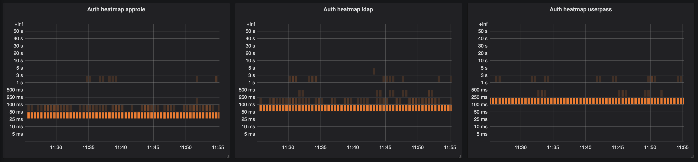

# HashiCorp Vault Reliability Exporter

## Configuration

See [example.config.yaml](example.config.yaml).

## Flags

* `-check` – Check configuration and exit
* `-config` – Path to configuration file (default "/etc/vault-reliability-exporter/config.yaml")
* `-debug` – Output verbose debug information
* `-expose-vault-metrics` - Expose Vault metrics with other telemetry
* `-log-format` – Log format, valid options are txt and json (default "txt")
* `-version` – Prints version and exit
* `-web.listen-address` – Address to listen on for telemetry (default ":9356")
* `-web.telemetry-path` – Path under which to expose metrics (default "/metrics")

## Metrics

* `vault_reliability_exporter_errors_total` by type, profile
* `vault_reliability_exporter_execution_time_bucket` by le, type, profile
* `vault_reliability_exporter_last_scrape_duration_seconds`
* `vault_reliability_exporter_scrape_time`
* `vault_reliability_exporter_scrapes_total`
